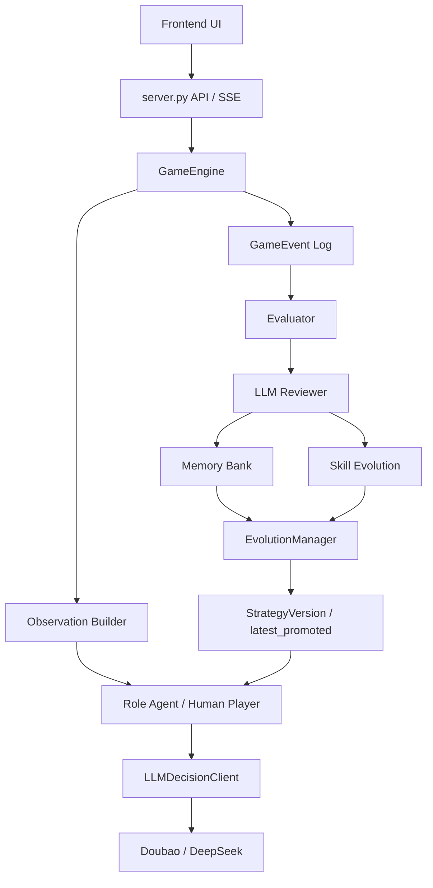

# AI 狼人杀 Agent Team 技术文档

> 面向字节跳动「Agent Teams 实践 - AI 狼人杀」课题答辩准备。
> 本文档按当前代码状态与已归档实验结果整理，后续新一轮演化完成后，可更新「实验结果」章节。

## 1. 项目摘要

本项目实现了一个可自主完成 9 人标准狼人杀的多智能体系统，并围绕比赛进阶路线 B+C 做扩展：

- B 线：多维评测、关键失误复盘、结构化报告和 Leaderboard。
- C 线：自动对局、复盘反思、策略记忆/技能卡演进、AB 验证和版本晋级。

主线规则采用 9 人局：

```text
3 狼人 + 1 预言家 + 1 女巫 + 1 猎人 + 3 村民
```

核心闭环：

```text
自动对局
-> 多维评测
-> LLM 上帝视角复盘
-> 生成记忆 / skill / 策略规划
-> 生成候选 Agent 版本
-> AB/批量对局验证
-> 晋级或回滚
```

当前系统只保留 LLM 决策路径，不再混入规则策略兜底。若模型未配置、超时、输出非法 JSON 或违反动作约束，系统会显式报错或按配置重试，便于真实评估大模型 Agent 的能力。

## 2. 比赛要求对照

| 要求 | 当前实现 |
|---|---|
| 至少 5 种角色 | 狼人、预言家、女巫、猎人、村民均已支持 |
| 独立决策逻辑 | 各角色有独立 Prompt 摘要、动作空间、策略记忆和 skill |
| 完整对局流程 | 夜晚行动、白天发言、投票、PK、放逐、猎人开枪、胜负判定 |
| 信息隔离 | `PrivateObservation` 按角色权限构造，狼队、查验、女巫夜间信息严格隔离 |
| 对局日志 | `logs/games/` 保存每局事件、Agent 输入摘要、输出、耗时、复盘 |
| 前端 UI | 支持观战、实时流式播放、Agent I/O、复盘、演进任务、人机对战 |
| 进阶 B | 多维评分、bad case 检测、LLM 复盘、记忆入库、排行榜 |
| 进阶 C | 自动演化、多版本策略记忆、skill evolution、晋级/拒绝规则、版本回溯 |

## 3. 总体架构



主要模块：

| 模块 | 文件 | 职责 |
|---|---|---|
| 数据结构 | `werewolf_ai/models.py` | 角色、阶段、动作、玩家状态、私有观察、决策、事件、评测报告 |
| 对局引擎 | `werewolf_ai/engine.py` | 回合流转、夜间行动、白天发言、投票、胜负判定、事件流 |
| LLM 调用 | `werewolf_ai/llm.py` | Prompt 构造、模型切换、JSON 解析、输出校验、重试和耗时记录 |
| 连续认知 | `werewolf_ai/belief_state.py` | 每个座位的怀疑、信任、声明、计划和票型记忆 |
| 评测器 | `werewolf_ai/evaluator.py` | 多维评分、关键失误识别、阵营贡献统计 |
| 复盘器 | `werewolf_ai/reviewer.py` | LLM 上帝视角复盘、bad case、memory candidates |
| 长期记忆 | `werewolf_ai/memory_store.py` | 记忆库、版本快照、最新晋级版本、复盘记忆入库 |
| 记忆召回 | `werewolf_ai/memory_retriever.py` | BM25/相关性召回角色记忆 |
| skill 演化 | `werewolf_ai/skill_evolution.py` | 从错误和复盘生成、强化、精炼技能卡 |
| skill 使用统计 | `werewolf_ai/skill_usage.py` | skill 召回、命中估计、归档统计 |
| 演化管理 | `werewolf_ai/evolution.py` | 批量对局、版本生成、晋级判定、Leaderboard |
| 演化规划 | `werewolf_ai/evolution_strategist.py` | LLM 给出下一轮演化方向和候选 skill/memory |
| 前端服务 | `server.py`, `static/` | API、SSE、观战、人机对战、后台演化任务 |

## 4. 对局规则设计

### 4.1 身份与胜负条件

当前主线是 9 人屠边局：

- 好人阵营：预言家、女巫、猎人、3 村民。
- 狼人阵营：3 狼人。
- 好人胜利：所有狼人阵亡。
- 狼人胜利：3 个平民全部阵亡，或 3 个神职全部阵亡。

这里特别修复过一个早期误判：不是「任意 3 个好人死亡」就算狼人屠边，而是平民边或神职边被屠完才算。

### 4.2 阶段流转

```text
夜晚：
1. 狼人独立提交刀人意向
2. LLM 狼队会议协调最终夜刀
3. 预言家查验
4. 女巫救人 / 毒人
5. 夜间死亡结算

白天：
1. 公布公开死亡结果
2. 存活玩家顺序发言
3. 同步投票
4. 若最高票平票，进入 PK 发言和二次投票
5. 放逐结算
6. 猎人死亡时可选择是否开枪
7. 胜负判定
```

### 4.3 同步投票

投票阶段采用「冻结观察 -> 并发决策 -> 统一公开」：

- 所有存活玩家在看到同一轮投票前公开信息后同时决策。
- Agent 不能看到本轮其他人的投票后再跟票。
- 支持弃票。
- 平票进入 PK，再投仍平票则无人出局。

这样更接近真实狼人杀，也减少了串行调用导致的跟票偏差。

### 4.4 狼队夜间会议

狼人夜间不是简单随机或固定规则指定，而是结构化 LLM 协同：

1. 每只狼人先基于自己的视角提交个人刀人提案。
2. 狼队协调器读取狼队私有上下文和提案。
3. 协调器输出：
   - 最终刀人目标。
   - 选择理由。
   - 次日可选协同路线。
   - 风险提示。
4. 该计划只写入狼人私有信息，好人阵营不可见。

这使狼队具备一定「团队内协商」能力，同时避免三狼在白天完全同模板行动。

## 5. 信息隔离与连续认知

### 5.1 私有观察

每次 Agent 行动前，引擎都会构造 `PrivateObservation`。它只包含当前玩家有权看到的信息：

| 玩家类型 | 可见信息 |
|---|---|
| 所有人 | 自己身份、公开玩家状态、公开发言、公开投票、公开死亡结果 |
| 狼人 | 狼队友身份、狼队夜间会议结果、狼队策略空间 |
| 预言家 | 自己历史查验结果 |
| 女巫 | 当夜被刀目标、解药/毒药状态 |
| 猎人 | 是否可开枪 |
| 村民 | 无额外夜间信息 |

前端观战视角能看到完整日志，但那是调试/赛后视角，不会反向进入 Agent 输入。

### 5.2 连续认知 BeliefState

API 调用本身是 stateless 的。也就是说，每次调用模型都是一个新的 Chat Completion，不天然继承上一轮上下文。

为了让玩家有连续认知，系统显式维护了每个座位的 `BeliefState`，并在下一次决策时注入 Prompt。它包含：

- 当前怀疑对象。
- 当前信任对象。
- 已公开身份声明。
- 票型记忆。
- 自己曾经的承诺与计划。
- 对关键玩家的身份假设。
- 当前局势摘要。

这相当于给每个座位维护一块「长期白板」，既能延续认知，又能保持信息隔离。

## 6. LLM 决策协议

### 6.1 模型接入

当前支持：

- 方舟 Ark / Doubao-Seed-2.0-pro。
- DashScope OpenAI-compatible / DeepSeek V4 Flash。
- DashScope Generation / DeepSeek V3.2 推理模式。

真实 API Key 只从 `.env` 读取，不写入仓库或文档。

### 6.2 Prompt 输入结构

LLM 输入不是纯自然语言闲聊，而是中文系统提示 + 结构化局面 JSON。核心字段包括：

- 游戏规则摘要。
- 当前阶段和合法动作。
- 当前玩家身份和阵营目标。
- `public_history`：公开事件历史。
- `private_knowledge`：角色私有信息。
- `strategy_memory`：角色长期策略记忆。
- `BeliefState`：本座位连续认知。
- `callable_skills`：召回的可选技能卡。
- 输出 JSON schema。

Prompt 中明确说明：

- 只能基于可见信息决策。
- 白天公开推理必须引用 `public_history` 的事件 id。
- 狼人可以策略性不诚实，但不能暴露狼队私有信息，也不能编造不存在的公开事件。
- skill 是可选工具，不是强制命令。

### 6.3 输出协议与校验

Agent 必须输出结构化 JSON，典型字段：

```json
{
  "action": "speak | vote | attack | check | save | poison | shoot | pass",
  "target_id": 3,
  "speech": "公开发言文本",
  "reason": "决策理由",
  "confidence": 0.82,
  "evidence_event_ids": [12, 18],
  "quoted_evidence": ["P2 投给 P5", "P5 发言质疑 P2"],
  "deception_intent": "狼人白天伪装意图",
  "public_cover_story": "狼人公开包装逻辑"
}
```

系统会做强校验：

- action 必须属于当前合法动作。
- target 必须合法且存活。
- 女巫救人目标必须等于当夜被刀目标。
- PK 投票只能投 PK 对象。
- 白天公开推理必须引用公开事件。
- 预言家查验只能公开阵营结果，不能误报具体身份。
- 狼人白天发言/投票必须输出伪装意图和公开包装。

非法输出会触发修复提示或直接报错，避免错误静默进入对局。

## 7. Agent、Memory 与 Skill

### 7.1 角色 Agent

每类角色都有独立策略目标：

| 角色 | 核心策略目标 |
|---|---|
| 狼人 | 隐藏身份、制造合理分歧、夜间找神、必要时悍跳/倒钩、避免票型暴露 |
| 预言家 | 合理查验、选择起跳时机、传递查杀/金水信息、带队归票 |
| 女巫 | 判断解药和毒药收益，避免误毒强好人，保护关键轮次 |
| 猎人 | 维护身份可信度，死亡时基于高置信证据开枪或不开枪 |
| 村民 | 表水、分析发言和票型、跟随可信信息源、避免无依据分票 |

### 7.2 Memory Bank

`data/memory/memory_bank.json` 是跨版本长期记忆库。来源包括：

- LLM 复盘产出的角色级经验。
- 人工补写的复盘记忆。
- 历史失败局的启发式回填。

每条记忆带有：

- role。
- memory 文本。
- status：如 pending、approved、approved_auto。
- confidence。
- source。
- sources / evidence。

记忆召回采用 BM25/相关性筛选，而不是把全部历史塞进 Prompt。这样可以控制输入长度，也降低无关经验污染当前局面的概率。

### 7.3 Skill Evolution

skill 是比 memory 更结构化的策略资产。典型 skill 包含：

- skill_id。
- title。
- trigger：触发条件。
- steps：执行步骤。
- avoid：避免事项。
- confidence。
- support_count。
- source。
- skill_version。

示例：

```text
技能名：狼队投票分线
触发：白天投票前发现多名狼队友想压同一好人目标，且无公开查杀级证据支撑。
执行：至少一名狼人分票、弃票、倒钩或轻踩队友；每个投票理由必须来自不同公开事件。
避免：三狼裸冲同一目标；复制队友发言理由。
```

skill 的优势：

- 比普通 memory 更像「可调用策略工具」。
- 有触发条件，不应被机械套用。
- 可版本化演进，例如 `v1 -> v2 -> v3`。
- 可以统计召回和使用情况。

当前 skill 更新机制：

- `add`：发现新模式，新增 skill。
- `refine`：同类错误反复出现，升级旧 skill。
- `reinforce`：相同高质量经验重复出现，提高置信度。
- `retire_candidate`：低价值或预算外 skill 标记为候选淘汰。

人工 review 入口：

```text
data/memory/role_memory_*.json
-> role_memories
-> <role>
-> parameters.role_skills
-> parameters.skill_evolution_operations
```

## 8. 多维评测与复盘

### 8.1 评分维度

评测器不只看胜负，而是输出多维分数：

| 维度 | 含义 |
|---|---|
| overall | 综合表现 |
| speech_quality | 发言质量、信息量、逻辑一致性 |
| vote_quality | 投票目标和公开证据是否匹配 |
| skill_quality | 预言家/女巫/猎人等技能使用质量 |
| team_contribution | 行为是否提升己方胜率 |
| social_influence_quality | 带队、归票、影响局势能力 |
| wolf_deception_quality | 狼人伪装、制造分歧、对跳/悍跳质量 |
| wolf_deception_diversity | 狼人发言和投票是否避免同模板 |
| mistake_penalty | 关键失误惩罚 |

### 8.2 关键失误识别

已覆盖的典型 bad case：

- `werewolf_exposed_pack_vote`：狼队集中裸冲导致票型暴露。
- `werewolf_incomplete_fake_seer_claim`：狼人悍跳预言家但查验链不完整。
- `seer_failed_to_reveal_wolf`：预言家查到狼但未有效传递。
- `seer_mechanical_day1_claim`：预言家无查杀、无压力时机械首日起跳。
- `hunter_shot_good`：猎人误枪好人。
- `villager_ignored_confirmed_wolf`：好人忽视高可信查杀/强证据。

### 8.3 LLM 上帝视角复盘

每局结束后，Reviewer 会从上帝视角读取完整对局，输出：

- game summary。
- good cases。
- bad cases。
- role reflections。
- memory candidates。
- confidence。
- evidence event ids。

复盘结果会写入对局归档，并可进入 memory bank。这样 B 线评测既服务展示，也服务 C 线演进。

## 9. 自进化机制

### 9.1 演化流程


### 9.2 晋级规则

晋级不是只看单局胜负，而是综合比较：

- overall 是否显著提升。
- mistakes_per_game 是否下降或可接受。
- 是否触发严重回退。
- 候选版本是否完整跑完设定局数。

这避免了「某个版本偶然赢了一局」就被误晋级。

### 9.3 LLM Evolution Strategist

当 `LLM_STRATEGIST_ENABLED=true` 时，系统会额外调用一个演化规划器。它读取当前版本的聚合指标和错误分布，输出：

- 下一轮重点修复角色。
- 指标目标。
- 可能新增或精炼的 skill。
- 可能写入的 memory。
- 风险控制建议。

它只给方向，不直接决定晋级。最终仍由真实对局指标裁判。

### 9.4 冻结测评

冻结测评用于把“训练/演进”和“正式评估”分开。运行时选择一个候选版本和一个基线版本，系统会在相同种子区间附近各跑指定局数，并输出胜率、overall、投票质量、技能质量和平均失误数差异。

冻结测评会关闭以下写入：

- 不调用 LLM 复盘写入 memory bank。
- 不调用演进规划器。
- 不生成新的角色记忆快照。
- 不更新 `latest_promoted.json`。

它只保留对局归档和测评结果，适合答辩时证明某个版本确实优于初始版本或上一稳定版本。

命令行示例：

```powershell
python scripts/run_demo.py frozen-eval --version latest --baseline-version initial --games 20 --llm-provider ark
```

前端中选择 `Version` 作为候选版本，选择 `Base Memory` 作为基线版本，设置 `AB Games` 后点击 `Frozen Eval` 即可。前端会通过 SSE 订阅后台冻结测评任务，实时展示候选版本和基线版本每一局的开始、事件流、完成、错误和最终对比结果。

## 10. 前端与可观测性

前端当前支持：

- 实时流式对局播放。
- 圆桌座位状态。
- 玩家存活、身份、阵营、死亡原因展示。
- 公开时间线。
- 隐藏夜间行动开关。
- Agent I/O 面板。
- LLM 输出、理由、引用证据、耗时、metadata。
- skill 召回与使用统计。
- 复盘报告。
- Leaderboard。
- 冻结测评模式。
- 后台持续演进任务。
- 人机对战模式。

重要 API：

| API | 用途 |
|---|---|
| `GET /api/game` | 生成完整单局 |
| `GET /api/game/stream` | SSE 实时流式对局 |
| `GET /api/evolution` | 同步演化 |
| `GET /api/evolution/start` | 后台演化任务 |
| `GET /api/evolution/status` | 查询后台任务 |
| `GET /api/evolution/events` | SSE 订阅后台演化 |
| `GET /api/versions` | 列出可选策略版本 |
| `GET /api/frozen-eval/start` | 启动后台冻结测评任务 |
| `GET /api/frozen-eval/events` | SSE 订阅冻结测评进度 |
| `GET /api/frozen-eval` | 同步固定版本冻结测评，不写入演进记忆 |
| `GET /api/ab` | AB 对比 |
| `POST /api/human/decision` | 人机对战提交真人动作 |

## 11. 数据产物

| 路径 | 内容 |
|---|---|
| `logs/games/` | 每局完整归档，含事件、复盘、Agent I/O、skill 使用 |
| `logs/evolution_jobs/` | 后台演进任务进度和结果 |
| `data/memory/memory_bank.json` | 长期记忆库 |
| `data/memory/player_profiles.json` | 座位人格/风格记忆 |
| `data/memory/role_memory_*.json` | 各版本角色策略记忆和 skill |
| `data/memory/evolution_runs/` | 演进 run 汇总、Leaderboard、晋级记录 |
| `data/memory/latest_promoted.json` | 当前最新晋级版本指针 |

这些文件构成答辩时的「可审核链路」：每个结论都可以追溯到具体对局、具体事件、具体版本。

## 12. 当前实验结果快照

截至目前已稳定晋级的版本：

```text
latest_promoted = evolved_skill_r10_v6
base_version = evolved_skill_r9
evolution_mode = skill
```

最近一次完整演化 run：

```text
data/memory/evolution_runs/run_20260607_135538_596033_evolved_skill_r10_v6.json
```

核心指标：

| 版本 | 是否晋级 | Overall | Vote | Skill | 狼人欺骗 | 平均失误/局 |
|---|---:|---:|---:|---:|---:|---:|
| `evolved_skill_r9` | 基线 | 77.12 | 65.55 | 76.20 | 86.67 | 2.00 |
| `evolved_skill_r10_v6` | 是 | 80.35 | 72.79 | 75.74 | 90.00 | 1.00 |
| `evolved_skill_r11_v2` | 否 | 79.42 | 66.55 | 81.78 | 95.33 | 2.33 |
| `evolved_skill_r12` | 否 | 80.70 | 65.86 | 80.31 | 97.33 | 1.33 |

观察：

- `r10_v6` 相比 `r9` 综合分提升 `+3.23`，平均失误从 `2.0` 降至 `1.0`，因此晋级合理。
- `r12` 虽然 overall 略高，但投票质量下降且失误率上升，所以被拒绝，说明晋级规则能防止表面分数波动带来的误晋级。
- 狼人欺骗能力有提升，但 `werewolf_exposed_pack_vote` 仍是主要残留问题。
- 预言家机械首日起跳仍偶发，需要继续通过 skill/记忆演进优化。

## 13. 测试与质量保障

当前测试覆盖：

- 对局流程能完整结束。
- 信息隔离不泄露狼队、查验、女巫夜间信息。
- 屠边规则正确。
- 投票支持弃票、平票、PK。
- 同步投票不泄露本轮票型。
- LLM 输出校验、JSON 修复、非法动作拦截。
- Memory bank 写入和召回。
- Skill evolution add/refine/reinforce。
- Skill usage 统计。
- LLM Reviewer 和 Evolution Strategist 输出规范。
- 晋级规则接受/拒绝边界。

常用验证命令：

```powershell
conda activate werewolf
python -m unittest discover -s tests -v
python -m compileall werewolf_ai scripts
```

## 14. 答辩演示路线

建议答辩现场按 5 段展示：

1. **规则和角色**：展示 9 人局配置、身份分配和胜负条件。
2. **实时对局**：前端启动一局流式对局，展示白天发言、夜间隐藏、投票和死亡结算。
3. **信息隔离证明**：切换上帝视角和单 Agent 私有视角，说明狼人、预言家、女巫分别能看到什么。
4. **复盘评测**：打开一局归档报告，展示分数、bad case、改进建议和证据事件。
5. **自进化结果**：展示 evolution run 的 leaderboard，说明为什么 `r10_v6` 晋级、为什么 `r11/r12` 被拒绝。

可提前准备的演示文件：

- `logs/games/` 中一局质量较高的完整对局。
- `data/memory/evolution_runs/run_20260607_135538_596033_evolved_skill_r10_v6.json`。
- `data/memory/latest_promoted.json`。
- `data/memory/role_memory_evolved_skill_r10_v6.json`。

## 15. 风险与下一步优化

当前主要风险：

- LLM 调用耗时较高，单次决策多数在 20-40 秒，偶发长尾。
- 多人共享 API 时可能遇到 429 限流，需要更保守的冷却和重试。
- skill 仍是通过相关性召回后进入 Prompt，不是模型主动工具调用协议。
- 狼人欺骗已经增强，但还未完全形成稳定的悍跳、倒钩、分线组合策略。
- 预言家和女巫仍可能出现机械化打法，需要继续降低模板化。

建议下一步实验：

```text
Evo Rounds = 6-8
Games / Round = 3
AB Games = 3
Base Version = latest
Evolution Mode = skill
```

如果目标是探索新 skill，可以使用：

```text
Evo Rounds = 12
Games / Round = 1
AB Games = 1
```

但这种设置噪声较大，适合探索，不适合作为最终答辩证明。最终汇报建议使用每版本 10-20 局的统计结果。

## 16. 一句话总结

本项目的核心价值不是只做一个能跑完狼人杀的程序，而是实现了一个可观测、可复盘、可记忆、可演进的多 Agent 博弈系统：Agent 在严格信息隔离下完成协作与欺骗，系统通过评测和复盘把 bad case 沉淀为策略资产，再用真实对局验证策略版本是否真正变强。

## 17. Codex 审查式 Skill 进化

为了避免“同一个模型既当选手、又当裁判、又当教练”的闭环偏差，项目新增了 Codex Skill Lab 模式。该模式把实验和进化拆成两层：

```text
Doubao 玩家层：负责真实对局采样，产生发言、投票、夜间行动和完整日志
Codex 审查层：负责读取日志、定位失败模式、审查当前 skill、创建候选 skill 版本
```

运行命令：

```powershell
python scripts/run_codex_skill_lab_job.py --version latest --games 5 --llm-provider ark --output-dir logs/codex_skill_lab
```

该模式会生成：

- `logs/games/*.json`：逐局完整归档。
- `logs/codex_skill_lab/*_progress.jsonl`：采样进度。
- `logs/codex_skill_lab/*_codex_review_pack.json`：Codex 审查包，包含聚合评分、archive 列表、错误列表、当前 skill 摘要和审查协议。

该模式明确禁用：

- LLM reviewer 自动复盘。
- memory bank 自动写入。
- strategist 自动规划。
- role memory snapshot 自动生成。
- latest promoted 自动更新。
- skill 自动 add/refine/reinforce。

因此它更适合做“研究员式”迭代：

```text
1. 豆包跑一批固定版本对局。
2. Codex 先看聚合指标和 mistake types。
3. Codex 选择一个主要失败模式，例如狼人同模板、预言家机械起跳、女巫机械首夜救。
4. Codex 检查 2-5 局代表日志，确认是 skill 缺失、触发弱、步骤弱、召回弱，还是评测器误伤。
5. Codex 创建候选 role_memory 版本，不直接覆盖 latest。
6. 用 frozen eval 对比 candidate vs latest。
7. 只有在目标错误下降且 overall 无明显回退时，才考虑晋级。
```

这个设计让“自进化”不只是黑箱自动循环，而是有可审计的科学实验链路：样本由真实对局产生，候选修改有证据支撑，最终效果由冻结测评验证。
